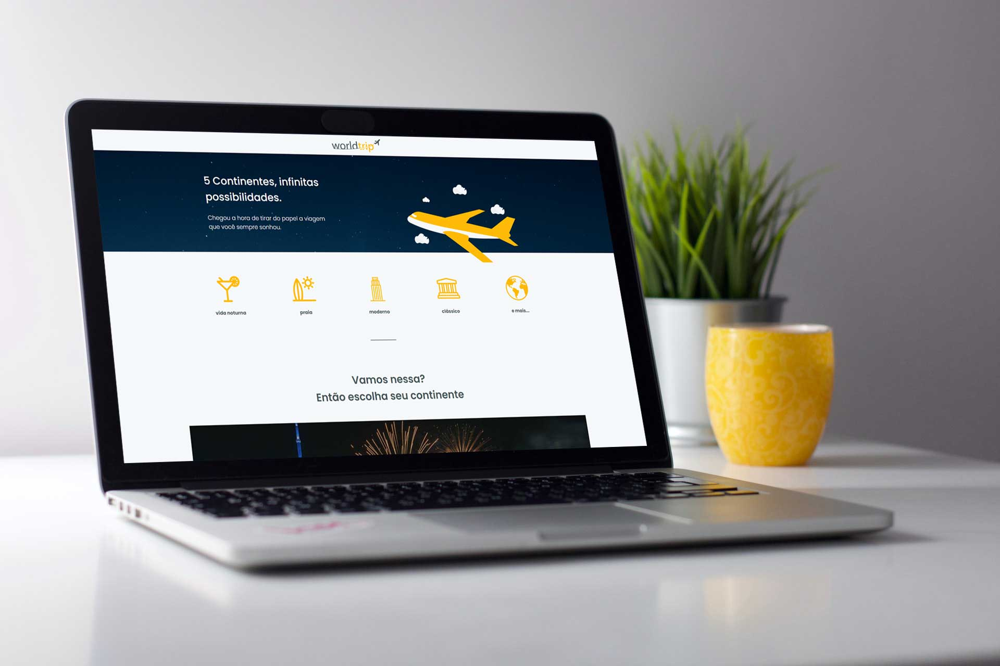

# Projeto



Esse projeto é um desafio realizado no curso Ignite da [🚀 Rocketseat](https://www.rocketseat.com.br).
O objetivo do projeto era desenvolver um site a partir um layout disponibilizdo no figma.


## 👨🏾‍💻 Stack utilizada

- [Next](https://nextjs.org)
- [TypeScript](https://www.typescriptlang.org)
- [Chakra-ui](https://chakra-ui.com)
- [Miragejs](https://miragejs.com)


## Uso/Exemplos

```
yarn dev
```
or
```
npm run dev
```

